***English** · [Français](README.fr.md)*

# Silicon Casino

**A five-game casino in your pocket — virtual chips only.**
M5Stack Cardputer ADV · ESP32-S3 · 240 × 135 display · fully offline.

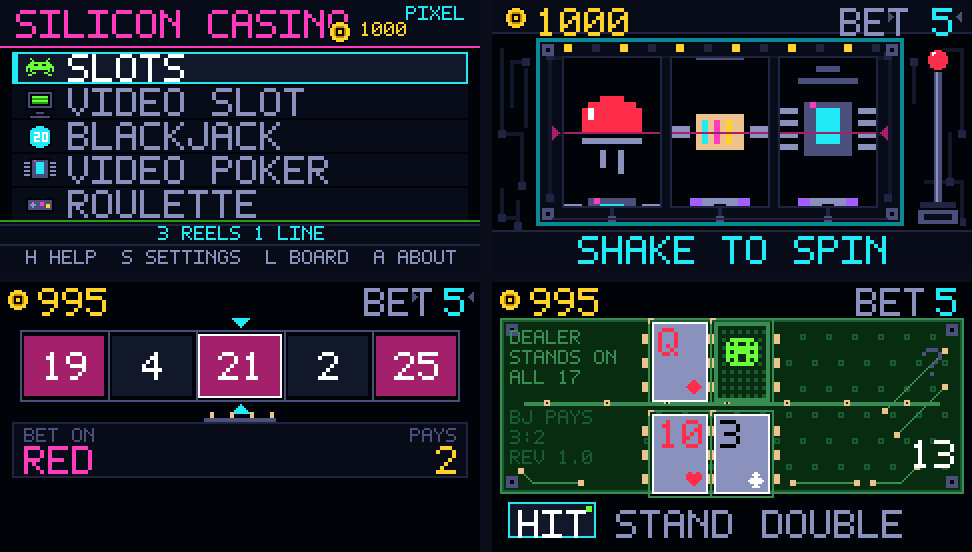

> ### Shake to spin.

Silicon Casino is an offline casino toy for the M5Stack **Cardputer ADV**:
three-reel slots, a 5×3 video slot, blackjack, Jacks-or-Better video
poker and a European roulette — sharing one balance, one leaderboard, and
one rule: **virtual chips only**. No real money, no purchases, no
account, no network. You can never be ruined for good: the house refills
you. The randomness comes from the ESP32's hardware generator.

Its visual identity is the machine itself: the slot cabinet is a **printed
circuit board** (mounting holes, traces, vias), the blackjack table is
routed like one, the roulette wheel sits on a rotary encoder — and the
reels spin geek glyphs. A setting brings the classic symbols back:
the geek skin is a gift, not a wall.

---

## Getting around

Everything is played one-handed, and the lobby tells you where you are.

| Key | Action |
|---|---|
| `space` / `enter` | confirm — spin, deal, draw, launch the ball |
| **shake the device** | pulls the lever: spins the reels, launches the ball |
| `←` `→` | change bet — or move the cursor in a hand |
| `↑` `↓` | navigate the lobby, pick a roulette number |
| `h` | help for the game under the cursor (paged — chevrons scroll) |
| `s` | settings — global in the lobby, per-game in a game |
| `l` | leaderboard |
| `a` | about |
| `esc` | back — works **everywhere, any time**, even mid-hand |
| `esc` (lobby) | quit |

On the device the arrows are `,` `/` `;` `.` and back is `` ` ``.
A hand you leave mid-play is frozen, not settled: it waits for you.

Left idle for twelve seconds (configurable), any game slips into a
grey, silent, free **demo mode** — the attract loop of an arcade
cabinet — and hands back the keys at the first gesture.

---

## The screens

| | |
|:--:|:--:|
| 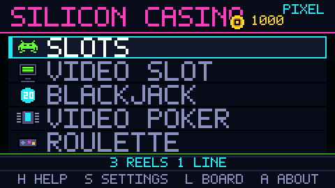 | 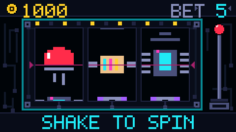 |
| **Lobby** — five games, one balance, the bet belongs to (player, game) | **Slots** — PCB cabinet, IMU lever drawn on the right |
| 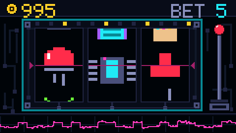 | 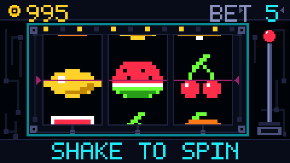 |
| **Mid-spin** — the bottom band is an oscilloscope probe: it scrambles when a reel locks | **GLYPHS setting** — same reels, same payouts, classic symbols |
| 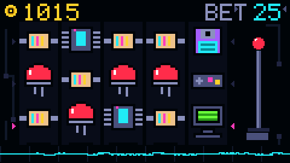 | 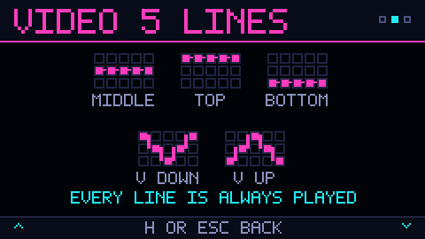 |
| **Video slot 5×3** — five paylines, chevron markers | **The help draws the lines** — a chevron isn't self-explanatory |
| 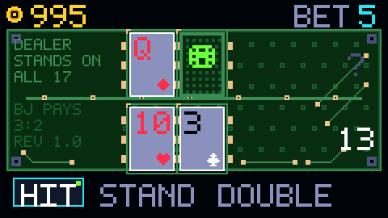 | 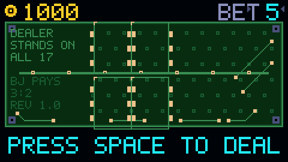 |
| **Blackjack** — 3:2, dealer stands on all 17, strategy hint | **The table is a PCB** — via stitching, 45° traces, silkscreen |
| 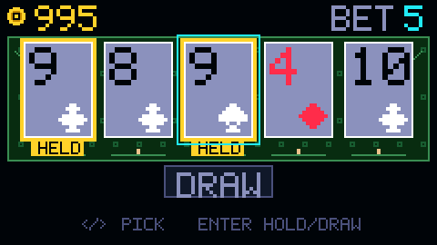 | 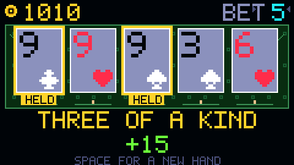 |
| **Video poker** — Jacks or Better 9/6, cards 38×54: they *are* the game | **Hand settled** — the DRAW band names what you made |
| 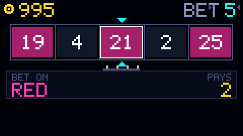 | 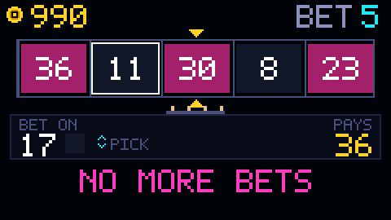 |
| **European roulette** — the wheel as a strip on a rotary encoder | **Ball launched** — it ticks every pocket, bounces before settling |
| 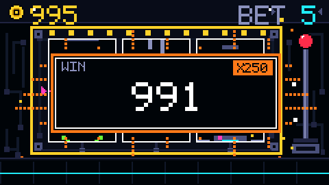 | 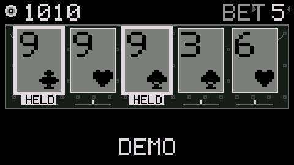 |
| **Win** — shared celebration panel, payout counts up | **Demo mode** — everything greys out, chips untouched |
| 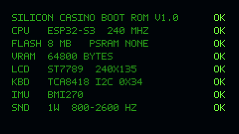 | 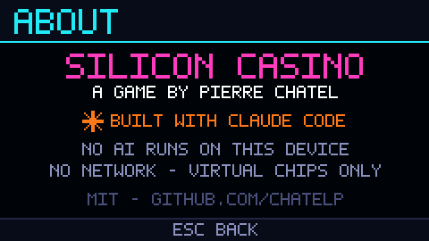 |
| **Boot** — fake self-test, **real numbers** (skippable, switchable) | **About** — who made it, with what, and what does *not* run here |

---

## The games — and their exact numbers

This project treats return-to-player as a **computed fact, not a tuning
knob**. Every figure below is exact — enumerated or derived analytically —
and locked by native tests that fail if a strip or paytable drifts.

| Game | Rules | RTP | How it's verified |
|---|---|---|---|
| **Slots 3×1** | 8 symbols, one payline, pair-left pays ×2 | **95.24 %** | analytic per-line probability from strip counts |
| **Video slot 5×3** | 5 paylines, own strip (the jackpot must stay findable) | **94.95 %** per line | same analytic method — enumeration would be 33 M cases |
| **Blackjack** | 3:2, dealer stands on all 17, double, no split | **95.81 %** | full-rules tests, strategy hint included |
| **Video poker** | Jacks or Better **9/6**, max-bet royal pays 800:1 | 9/6 full-pay table | all **2,598,960** hands enumerated; every textbook frequency matches |
| **Roulette** | European, single zero, ten bet kinds | **97.3 %** for *every* bet | all 37 pockets × 10 bets enumerated: 972,973 ppm each, exactly |

The balance is shared across games; the **bet is per (player, game)** and
persists. Bailout: hit zero between hands and the house refills +500 —
this is a toy about animation, not a lesson about loss.

<details>
<summary><b>Why the video slot needed its own reel strip</b></summary>

With the 3×1 strip (jackpot symbol at 1/32 per reel), five-of-a-kind
would land once every **33 million** spins — a jackpot nobody would ever
see. The video strip doubles the invader (2/32): five-of-a-kind every
~210k spins, and four-of-a-kind every ~14k becomes the real event. Same
paytable, same `evaluateLine()` for both formats — only the strips
differ, and a `static_assert` breaks the build if the art ever changes
the symbol count without the balancing being redone.

</details>

<details>
<summary><b>No naive modulo anywhere</b></summary>

`esp_random() % n` is biased whenever n doesn't divide 2³². The RNG is
injected as a function pointer (`esp_random()` on device, deterministic
xorshift in the simulator and tests) and `core::drawBelow()` draws by
rejection. A test hammers the distribution to keep it honest.

</details>

---

## The hardware

| | |
|---|---|
| **MCU** | ESP32-S3 (StampS3), dual-core Xtensa LX7 @ 240 MHz |
| **Memory** | 8 MB flash, 512 KB SRAM, **no PSRAM** |
| **Display** | ST7789, 1.14″, **240 × 135** — about 25 × 14 mm at ~245 ppi |
| **Keyboard** | 56 keys, **TCA8418** I²C controller at 0x34 |
| **Audio** | 1 W speaker — usable band ≈ **800–2600 Hz**, measured |
| **IMU** | BMI270 — the shake-to-spin lever |

The boot screen's fake self-test shows these same numbers: they are all
checked against the board definition and the drivers actually
instantiated. A fake boot screen announcing real hardware is a badge;
one announcing fictional hardware is just wallpaper.

Hardware lessons this project banked (each one measured, not assumed):

- The speaker reproduces **nothing below ~400 Hz** — every cue lives in
  800–2600 Hz, and a native test rejects any note outside the band.
- lgfx colour overloads are typed: a bare `0x18E3` literal is read as
  RGB888. Only named `constexpr uint16_t` colours exist in this codebase.
- The 16-bit sprite buffer stores RGB565 **byte-swapped** — the demo
  mode's greyscale pass byte-swaps around the luminance math.
- No M5 API in global constructors — even `&M5Cardputer.Display` taken
  early stores garbage and crashes at first `pushSprite`.

---

## Build, simulate, flash

```bash
brew install platformio sdl2
```

```bash
pio test -e test-native                     # 126 native tests, no hardware
pio run -e sim && .pio/build/sim/program    # macOS simulator, SDL, ×3
pio run -e cardputer-adv -t upload          # flash over USB
```

### The simulator is the front line

All rendering goes through the `lgfx::` API — never the hardware — so the
**same code** draws on the device and on the Mac. Visual iteration happens
at simulator speed; the device is only flashed for what a simulator judges
poorly: real colours, legibility in hand, sound, keyboard feel, the IMU
gesture.

It also produces deterministic captures (fixed seed, no window):

```bash
.pio/build/sim/program --shot    <dir>      # one frame
.pio/build/sim/program --frames  <dir> <n>  # a sequence, for GIFs
.pio/build/sim/program --screens <dir>      # one image per screen
python3 scripts/readme_images.py            # captures -> docs/images/
```

**Every image in this README comes out of it.** So do the screen cards of
the design system: a redrawn mockup always drifts; a capture cannot.

---

## Architecture

```
lib/core/   pure C++17 logic — zero Arduino/M5/lgfx includes, natively
            tested. Reels, paytables, economy, AND motion: pacing is
            logic, not drawing. Time enters as a `now` parameter, never
            read from a clock — transitions are testable, captures
            reproducible.
lib/hal/    hardware boundaries: display (M5GFX / LovyanGFX), keys, RNG
lib/ui/     rendering, strictly through lgfx::
src/        device main and simulator main, sorted by #ifdef
design/     single source of truth for the visual identity
test/       Unity tests of lib/core — 126 cases
```

One consequence worth stealing: the reel easing, the roulette ball's
bounce, the win-celebration pacing and even the oscilloscope trace under
the reels are **pure functions of `now`** living in `lib/core`. They are
tested frame by frame, column by column, like any other logic.

### One source of truth, generated both ways

```
design/tokens.json        palette + geometry
design/tools/art_*.py     16×16 glyphs, 5×7 font, icons
design/tools/gen.py       → design-system cards AND C++ headers
```

`lib/ui/palette.h`, `symbols.h`, `font5x7.h`, `layout.h` are **generated**
— editing them is useless, they get overwritten. The generator validates
the art (dimensions, colour keys) and fails rather than emit nonsense.
Colours are quantised to RGB565 at the source, so the design system shows
what the panel will actually display.

---

## Transparency

This project is a **collaboration between a human and an AI, stated in
full**: [Claude Code](https://claude.com/claude-code) is the principal
development agent — architect, implementer, simulator operator,
documentation maintainer. Every line of C++ in this repository was
written by it.

It is not a solo act. **Pierre CHATEL** is product owner, visual
director, tester and final decision-maker: the project's direction, its
guardrails (virtual chips only, never truly ruined, geek identity as a
rule), every visual verdict on the device's actual screen, and every
course correction — "the equaliser has no amplitude, change registers",
"the roulette stops too abruptly" — are his. The
[decision journal](docs/DECISIONS.md) records that dialogue, decision by
decision, including the AI's mistakes and what they cost.

The distinction that matters: built **with** an AI, but **no AI runs on
the device** — no network, no account, virtual chips, hardware TRNG. The
device says so itself: press `a` in the lobby.

---

## Documentation

The project documentation is in French.

| | |
|---|---|
| [CLAUDE.md](CLAUDE.md) | project doctrine, guardrails, measured hardware traps |
| [docs/DECISIONS.md](docs/DECISIONS.md) | the decision journal — D-001 to D-037 and counting |

---

## Licence

[MIT](LICENSE) — take it, learn from it, build on it.

The licence covers **the visual identity too**: palette, 5×7 font and
glyphs are in the repository and are as free as the code. There is no
brand to protect behind this name.

Third-party libraries (M5Unified, M5GFX, LovyanGFX) keep their own
licences.
